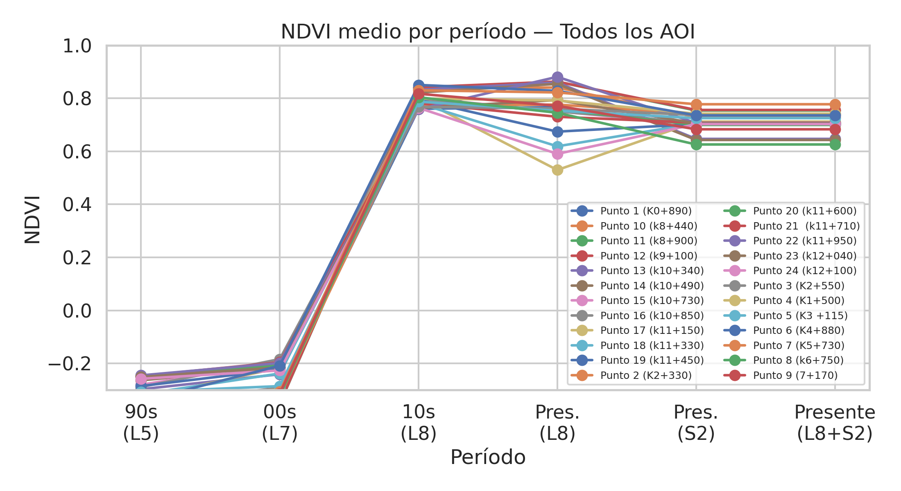
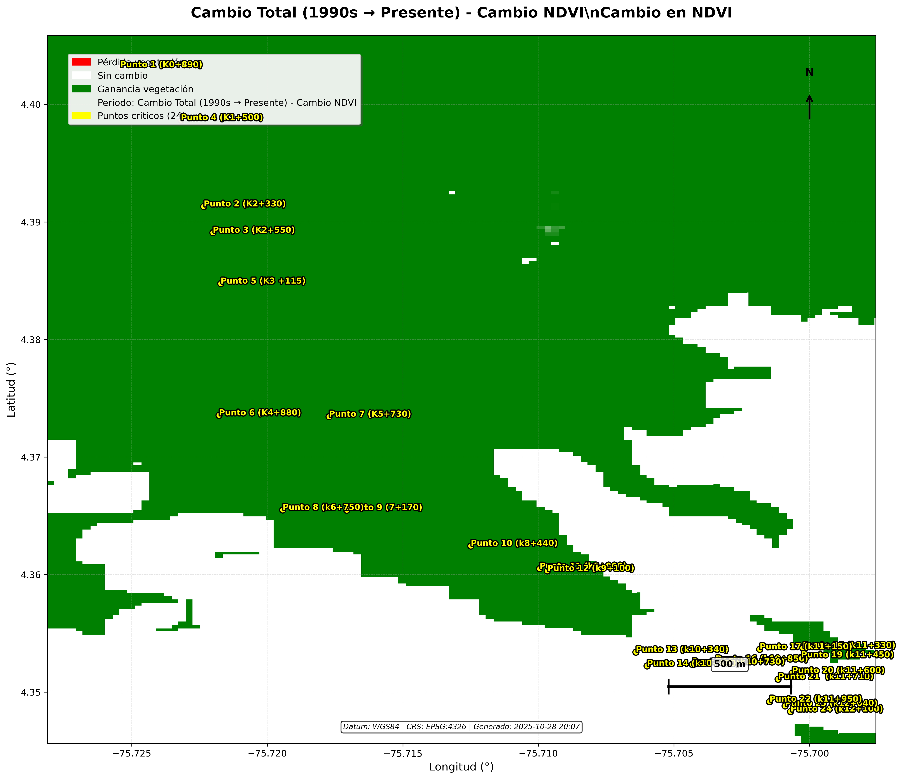

# Mountain Road Geotechnical Hazard Assessment
  ##    Pijao-Quindio, Colombia

**Applied geoscience + risk evaluation for mountain road infrastructure**
*Data anonymized — methodology and approach showcase*


---

## Context

Mountain road corridors in the Colombian Andes face persistent challenges from mass movement phenomena. Steep slopes exceeding 50% gradient, highly weathered volcanic soils, and annual precipitation above 2,500 mm create conditions where landslides, erosion, and slope failures regularly disrupt critical rural connectivity.

This project addressed geotechnical hazard assessment for a strategic road corridor serving isolated mountain communities. The road represents the sole access route for agricultural production and essential services, making its stability a matter of both economic viability and public safety.

The study integrated geological, hydrogeological, and geotechnical analyses to identify critical points requiring intervention, classify hazard levels along the corridor, and provide engineering recommendations for slope stabilization and drainage design. The work followed Colombian technical standards (INVÍAS Manual de Estabilidad de Taludes, SGC Guía Metodológica para Estudios de Amenaza) and produced actionable outputs for infrastructure decision-making.

---

## My Role

- Conducted **geological and hydrogeological evaluation** for a mountain road corridor, characterizing lithological units, structural features, and groundwater conditions
- Performed **multitemporal satellite analysis** (Landsat 5/7/8, Sentinel-2) to track vegetation dynamics and identify terrain changes over 30+ years
- Built a **hazard classification framework** based on Factor of Safety (FS) calculations, integrating geotechnical parameters with spatial analysis
- Developed **GIS-based risk assessment tools** including IDW interpolation, Voronoi tessellation, and automated raster processing pipelines
- Created an **interactive visualization dashboard** for stakeholder communication and technical decision support
- Produced **technical reports** synthesizing field observations, remote sensing analysis, and geotechnical modeling for engineering oversight

---

## Scope of Work

### Geology
- Regional geological context: metamorphic basement, Cretaceous volcano-sedimentary sequences, Plio-Pleistocene volcanic deposits
- Structural analysis: fault systems, foliation patterns, tectonic controls on slope stability
- Field reconnaissance: outcrop documentation, material characterization, weathering profiles
- Slope morphology: identification of landslide deposits, debris flows, erosion features

### Hydrogeology
- Characterization of hydrogeological units by infiltration capacity, storage, and hydraulic conductivity
- Identification of springs, seeps, and saturation zones affecting slope stability
- Conceptual groundwater flow model: recharge, transit, and discharge zones
- Drainage recommendations for surface and subsurface water management

### Hazard Analysis
- Factor of Safety calculation using limit equilibrium methods
- Spatial interpolation of geotechnical parameters across the corridor
- Hazard zonation following standardized classification thresholds
- Integration of conditioning factors: lithology, slope, rainfall, seismicity

### Vulnerability & Risk
- Inventory of exposed elements: road infrastructure, drainage structures, retaining walls
- Vulnerability assessment using fragility matrix methodology
- Risk classification combining hazard probability with consequence severity
- Prioritization framework for intervention planning

---

## Methodology

### Data Integration Approach

The analysis combined multiple data sources into a unified spatial framework:

```
┌─────────────────────────────────────────────────────────────────┐
│                    DATA INTEGRATION PIPELINE                     │
├─────────────────────────────────────────────────────────────────┤
│  FIELD DATA          REMOTE SENSING       SECONDARY SOURCES     │
│  ─────────────       ──────────────       ─────────────────     │
│  • Outcrop logs      • Landsat archive    • Geological maps     │
│  • GPS waypoints     • Sentinel-2 MSI     • Hydrogeological     │
│  • Geotechnical      • DEM (12.5m)          cartography         │
│    parameters        • Slope/aspect       • Climate records     │
│  • Photo records     • NDVI time series   • Seismic zonation    │
│                                                                  │
│                          ↓                                       │
│              ┌─────────────────────────┐                        │
│              │   GIS SPATIAL ANALYSIS   │                        │
│              │   • CRS alignment        │                        │
│              │   • Raster/vector ops    │                        │
│              │   • Interpolation        │                        │
│              │   • Classification       │                        │
│              └─────────────────────────┘                        │
│                          ↓                                       │
│              ┌─────────────────────────┐                        │
│              │   HAZARD ZONATION MAP   │                        │
│              └─────────────────────────┘                        │
└─────────────────────────────────────────────────────────────────┘
```

### Geotechnical Analysis

Factor of Safety (FS) was calculated for critical points using infinite slope and limit equilibrium methods. The continuous FS values were then spatially interpolated using Inverse Distance Weighting (IDW) to generate a hazard surface across the corridor buffer zone.

**Key methodological decisions:**
- Interpolate continuous FS values first, then reclassify to discrete hazard classes (more defensible than interpolating categories)
- Use Voronoi tessellation with phantom boundary points to ensure complete coverage
- Apply corridor buffer to focus analysis on the zone of influence

### Multitemporal Analysis

Satellite imagery spanning 1990–2024 was processed to detect vegetation changes indicative of slope instability:

- **Spectral indices**: NDVI (vegetation vigor), NBR (burn/disturbance detection)
- **Quality filtering**: Cloud masking, dry season composites
- **Sensor fusion**: Harmonized Landsat-Sentinel time series
- **Change detection**: Period-over-period differencing with threshold classification

The analysis monitored 24 critical points across the corridor, tracking vegetation dynamics over 30+ years:

<p align="center">
  
  <br><em>NDVI time series for all monitoring points (1990s–Present)</em>
</p>

<p align="center">
  
  <br><em>Cumulative vegetation change map (1990s vs Present)</em>
</p>

**Key findings from multitemporal analysis:**
- 90-99% of monitoring points show significant vegetation recovery
- Post-disturbance regeneration patterns detected via dNBR
- Change magnitudes >1.0 NDVI indicate major landscape transformations

> The complete Google Earth Engine analysis is available in [`multitemporal_analysis.ipynb`](multitemporal_analysis.ipynb)

### Classification Framework

Hazard levels follow Colombian national standards with five classes based on Factor of Safety thresholds:

| FS Range | Class | Hazard Level | Interpretation |
|----------|-------|--------------|----------------|
| FS < 1.0 | 5 | VERY HIGH | Unstable - immediate intervention required |
| 1.0 ≤ FS < 1.2 | 4 | HIGH | Marginally stable - priority intervention |
| 1.2 ≤ FS < 1.5 | 3 | MEDIUM | Conditionally stable - monitoring needed |
| 1.5 ≤ FS < 2.0 | 2 | LOW | Stable under normal conditions |
| FS ≥ 2.0 | 1 | VERY LOW | Stable - routine maintenance |


---

## Data & Tools

### Software Stack
- **QGIS**: Primary GIS platform for spatial analysis and cartographic production
- **Python**: Automated processing pipelines (geopandas, rasterio, scipy, numpy)
- **Google Earth Engine**: Multitemporal satellite image processing at scale
- **Streamlit**: Interactive dashboard development for stakeholder visualization

### Spatial Analysis Techniques
- DEM-derived terrain parameters (slope, aspect, curvature)
- IDW interpolation for continuous surface generation
- Voronoi tessellation for zone delineation
- Raster algebra for hazard reclassification
- Buffer analysis for corridor zone of influence

### Data Products Generated
- Continuous hazard raster (GeoTIFF)
- Hazard zone polygons (GeoPackage)
- Multitemporal change maps
- Technical cartography
- Statistical summaries and KPIs

---

## Risk Assessment Framework

### Hazard → Vulnerability → Risk

The assessment follows the standard risk equation:

```
Risk = Hazard × Vulnerability × Exposure
```

**Hazard (H)**: Probability of mass movement occurrence, derived from Factor of Safety analysis and historical precedent.

**Vulnerability (V)**: Fragility of exposed elements, assessed through:
- Structural condition of road infrastructure
- Presence/absence of drainage systems
- Retaining wall effectiveness
- Previous damage history

**Exposure (E)**: Elements at risk within the hazard zone:
- Road segments and pavement
- Culverts and drainage structures
- Retaining walls and slope protection
- Adjacent infrastructure

### Prioritization Matrix

Risk classification enables resource allocation:

| Risk Level | Interpretation | Action |
|------------|----------------|--------|
| HIGH | Unacceptable risk | Immediate structural intervention |
| MEDIUM | Significant risk | Planned intervention + monitoring |
| LOW | Acceptable risk | Routine maintenance |


---

## Results

### Key Findings

- Identified multiple sectors with FS < 1.0 requiring immediate stabilization
- Correlated hydrogeological conditions (springs, seepage zones) with highest-hazard areas
- Detected vegetation loss patterns in satellite record preceding documented slope failures
- Mapped structural controls (fault-parallel drainage) influencing instability distribution

### Decision Support Outputs

The analysis produced actionable deliverables:

1. **Prioritized intervention list** ranking critical points by risk level and estimated intervention cost
2. **Hazard zonation maps** at corridor and site scales for engineering design
3. **Drainage recommendations** based on hydrogeological characterization
4. **Monitoring protocol** specifying locations, methods, and trigger thresholds

### Technical Insights

- Weathered volcanic deposits showed highest susceptibility, particularly where groundwater discharge occurs at slope faces
- Multitemporal NDVI analysis proved effective for identifying incipient instability before visible scarps develop
- IDW interpolation of continuous FS values produced more realistic hazard surfaces than categorical approaches

---

## Why This Project Matters

### Infrastructure Resilience
Mountain roads in developing regions often represent the only connection between rural communities and markets, healthcare, and education. Understanding and mitigating geotechnical hazards directly impacts livelihoods and access to essential services.

### Applied Geoscience
This project demonstrates the integration of classical geological field methods with modern remote sensing and GIS analysis. The combination enables both site-specific understanding and corridor-scale hazard mapping.

### Risk-Informed Decision Making
By quantifying hazard and risk, technical studies like this enable rational resource allocation. Limited budgets can be directed to highest-priority interventions rather than reactive emergency response.

### Transferable Methodology
The analytical framework developed here—field reconnaissance, satellite time series, spatial interpolation, hazard classification—applies to mountain road corridors throughout the Andes and similar tropical mountain environments globally.

---

## Interactive Dashboard

The project includes a Streamlit-based visualization tool for exploring hazard data:


### Features
- Interactive map with toggleable layers (raster, Voronoi zones, critical points)
- Automatic raster type detection (discrete classes vs continuous FS)
- Statistics and KPI dashboard
- Methodology documentation


### Quick Start

```bash
# Setup environment
conda create -n hazard_dashboard python=3.11 -y
conda activate hazard_dashboard
conda install -c conda-forge geopandas rasterio -y
pip install streamlit streamlit-folium folium pillow

# Launch
streamlit run Home.py
```

### Project Structure

```
├── Home.py                 # Main entry point
├── config.py               # Thresholds, colors, parameters
├── pages/
│   ├── 1_Estadisticas.py   # KPIs and statistics
│   ├── 2_Mapa.py           # Interactive Folium map
│   └── 3_Metodologia.py    # Technical documentation
├── utils/
│   ├── data_loader.py      # GeoPackage loading
│   ├── geotiff_overlay.py  # Raster to Folium conversion
│   └── styles.py           # Map styling
└── data/
    └── <region>/           # Data per corridor
        ├── puntos.gpkg
        ├── corredor.gpkg
        ├── voronoi.gpkg
        └── raster_amenaza.tif
```

---

## Confidentiality Notice

> **Note**: This case study is anonymized. No client names, contract details, precise coordinates, or restricted documents are shared. Visualizations and descriptions are generalized for portfolio purposes. The methodology and technical approach are presented to demonstrate professional capabilities without compromising project confidentiality.

---

## Technical References

- INVÍAS (2022). *Manual de Estabilidad de Taludes*. Instituto Nacional de Vías, Colombia.
- SGC (2017). *Guía Metodológica para Estudios de Amenaza, Vulnerabilidad y Riesgo por Movimientos en Masa*. Servicio Geológico Colombiano.
- Varnes, D.J. (1978). Slope Movement Types and Processes. *Transportation Research Board Special Report 176*.

---

## License

MIT License - See [LICENSE](LICENSE) for details.

---

*This repository showcases applied geoscience methodology for infrastructure hazard assessment. The code and analytical framework are provided for professional reference.*
